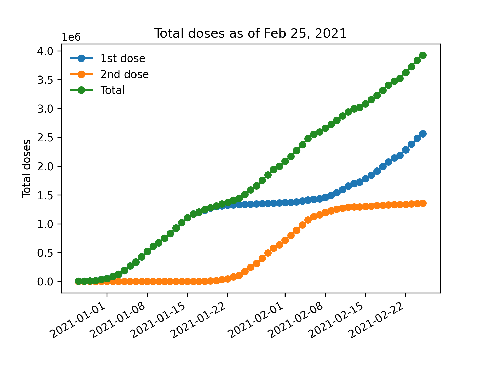
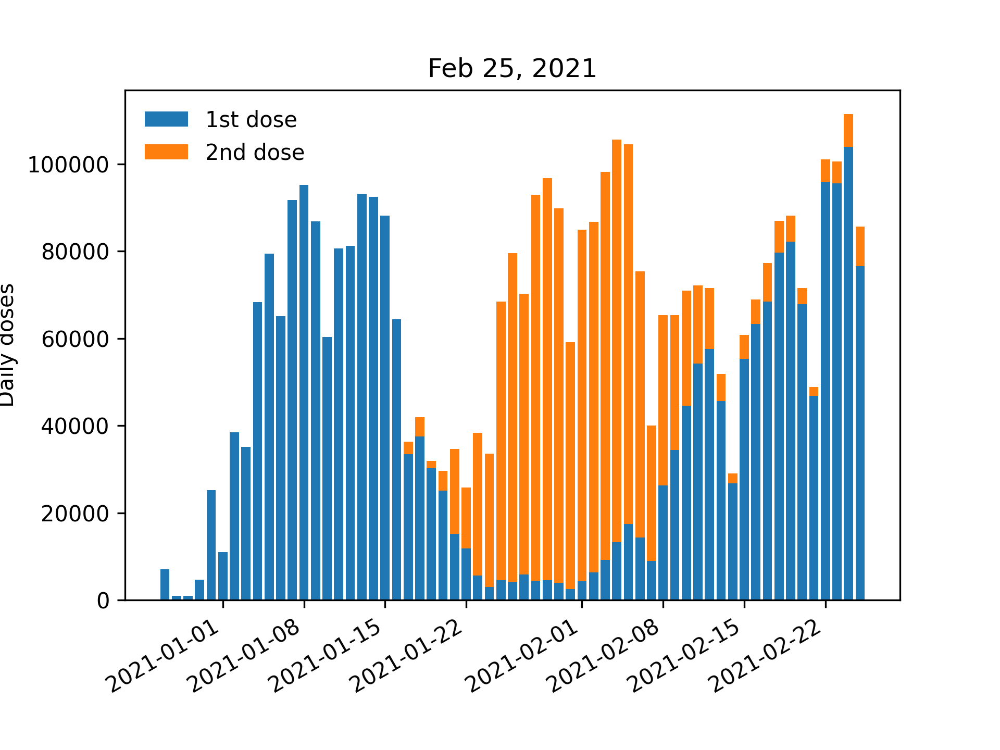

# VaccineItalyBot

Get information about vaccinations in Italy through Telegram. Add me at [t.me/VaccineItalyBot](https://t.me/VaccineItalyBot).

## What can this bot do?

* `/start`: Quick start guide
* `/latest`: Get latest data on vaccinations
* `/plot`: Get some charts on vaccinations
    - `/plot [regione]`: Get info on a specific region, e.g.: `/plot Molise`
* `/subscribe`: Receive daily updates automatically
* `/unsubscribe`: Stop receiving updates 

## Latest updates

